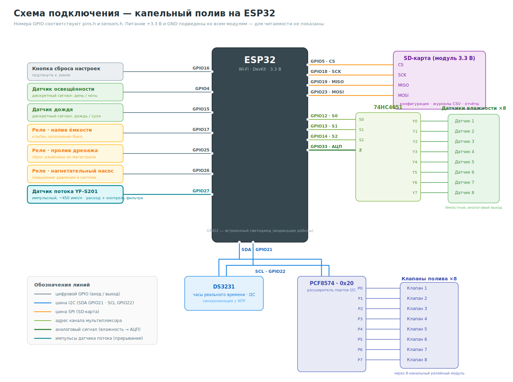
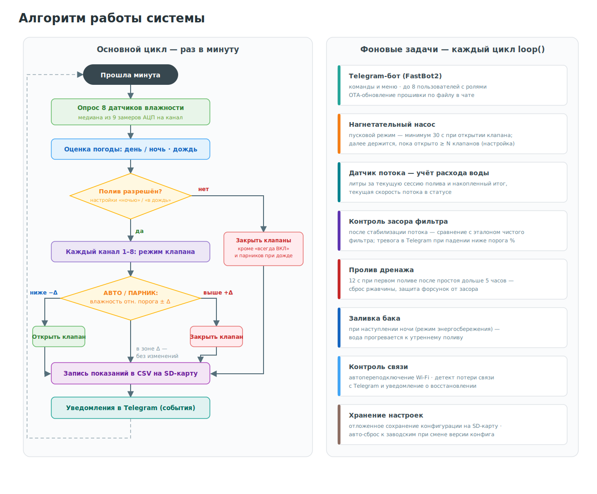
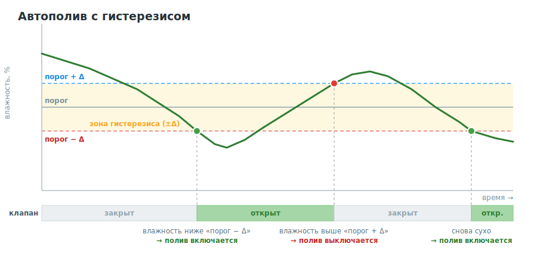
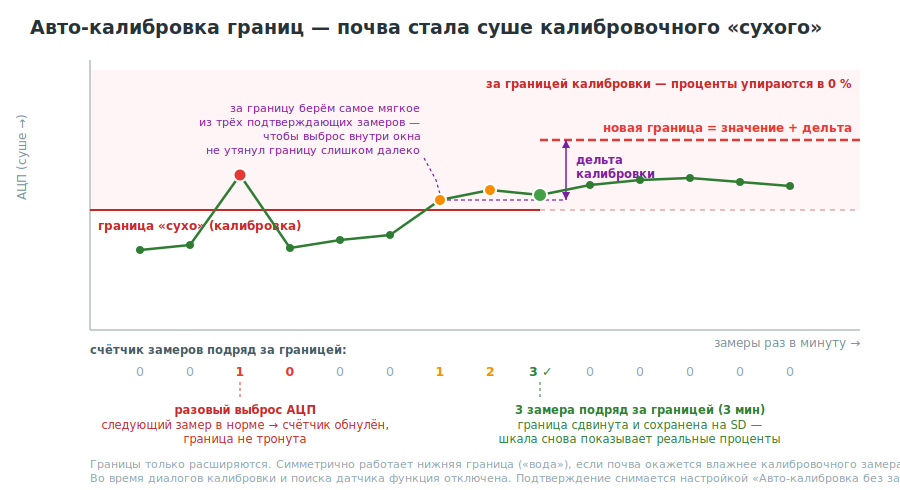
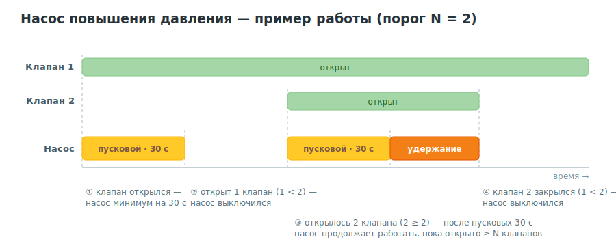
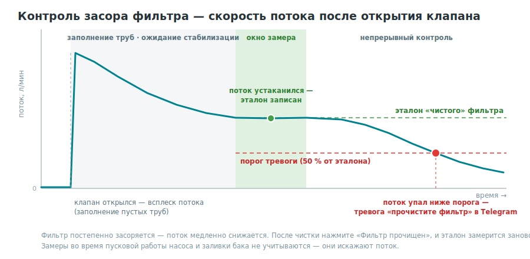

# 🌱 Капельный полив на ESP32


Автономная система капельного полива для дачного участка: 8 независимых каналов, автополив по влажности почвы, учёт расхода воды и контроль засора фильтра. Управление — полностью через Telegram-бота, без облаков и сторонних приложений ([библиотеки Alex Gyver](https://github.com/GyverLibs)).

## 📑 Оглавление

- [Возможности](#возможности)
- [Состав системы](#состав-системы)
  - [Компоненты](#компоненты)
  - [Схема подключения](#схема-подключения)
  - [Распиновка ESP32](#распиновка-esp32)
- [Установка](#установка)
- [Первый запуск](#первый-запуск)
- [Руководство пользователя](#руководство-пользователя)
  - [Команды бота](#команды-бота)
  - [Роли пользователей](#роли-пользователей)
  - [Структура меню](#структура-меню)
  - [Статус системы](#статус-системы)
  - [Типовые сценарии](#типовые-сценарии)
- [Как работает автоматика](#как-работает-автоматика)
- [Данные на SD-карте](#данные-на-sd-карте)
- [Справочник по пунктам меню](#справочник-по-пунктам-меню)
- [Обновление прошивки (OTA)](#обновление-прошивки-ota)
- [Лицензия](#лицензия)

## Возможности

- 🌿 **8 независимых каналов**: клапан + ёмкостный датчик влажности почвы на каждый
- 🤖 **Управление через Telegram** — настройка, статус, отчёты, до 8 пользователей с ролями
- 💧 **Автополив по влажности** с гистерезисом; режимы «всегда ВКЛ», «всегда ВЫКЛ», «авто», «парник»
- 🔧 **Авто-калибровка границ** датчиков: диапазон сам расширяется под реальные условия, разовые выбросы отфильтровываются
- 🌙 **Погодные блокировки**: ночь и дождь (настраиваются)
- 📟 **Датчик потока**: расход за сессию и накопленный итог, текущая скорость в статусе
- 🧽 **Контроль засора фильтра**: тревога в Telegram при падении потока ниже порога
- 💪 **Нагнетательный насос**: пусковой режим + удержание по числу открытых клапанов
- 🗑️ **Пролив дренажа** после простоя, 🚰 **заливка бака** на ночь
- 📊 **Журналы CSV** на SD-карте, графики и отчёты прямо в чате
- 📤 **OTA-обновление** прошивки файлом через Telegram

## Состав системы

### Компоненты

| Компонент | Назначение |
|-----------|------------|
| ESP32 (DevKit) | контроллер |
| SD-карта, модуль 3.3 В | конфигурация, журналы CSV, отчёты |
| Кнопка (подтянута к земле) | сброс настроек |
| Датчик освещённости (дискретный) | определение дня/ночи |
| Датчик дождя (дискретный) | блокировка полива в дождь |
| Датчик потока YF-S201 (~450 имп/л) | учёт расхода и контроль фильтра, ставится на общую магистраль |
| DS3231 (I2C) | часы реального времени, синхронизация с NTP |
| PCF8574 (I2C, адрес 0x20) | расширитель портов для 8 клапанов |
| Релейный модуль, 8 каналов | управление клапанами полива |
| Реле ×3 | нагнетательный насос, налив ёмкости, пролив дренажа |
| 74HC4051 | аналоговый мультиплексор датчиков влажности |
| Ёмкостные датчики влажности ×8 | по одному на канал |

### Схема подключения



### Распиновка ESP32

| GPIO | Подключение | GPIO | Подключение |
|------|-------------|------|-------------|
| 2 | встроенный светодиод (индикация) | 18 | SD-карта · SCK |
| 4 | датчик освещённости | 19 | SD-карта · MISO |
| 5 | SD-карта · CS | 21 | I2C · SDA (DS3231, PCF8574) |
| 12 | 74HC4051 · S0 | 22 | I2C · SCL (DS3231, PCF8574) |
| 13 | 74HC4051 · S1 | 23 | SD-карта · MOSI |
| 14 | 74HC4051 · S2 | 25 | реле пролива дренажа |
| 15 | датчик дождя | 26 | реле нагнетательного насоса |
| 16 | кнопка сброса настроек | 27 | датчик потока YF-S201 |
| 17 | реле налива ёмкости | 33 | АЦП — сигнал мультиплексора |

## Установка

**Потребуется:** Wi-Fi сеть с выходом в интернет и созданный Telegram-бот ([инструкция по созданию бота](https://kit.alexgyver.ru/tutorials/telegram-basic/)).

1. Соберите схему
2. Скачайте исходники репозитория
3. Скопируйте `secrets.example.h` в `secrets.h` и впишите токен своего бота (файл `secrets.h` не коммитится в git)
4. Прошейте ESP32 (Arduino IDE или arduino-cli, плата `esp32`)

> ⚠️ У бота в @BotFather пропишите список команд:
> ```
> reset - сброс состояния
> control - управление поливом
> status - текущий статус
> pause - остановка статусных сообщений
> continue - продолжение получения сообщений
> ```

## Первый запуск

1. **Настройка Wi-Fi.** При первом старте устройство поднимает собственную Wi-Fi точку. Подключитесь к ней — откроется страница настройки: выберите домашнюю сеть и введите пароль. После сохранения устройство перезагрузится.
2. **Регистрация владельца.** Напишите боту кодовое слово со страницы настройки — вы становитесь владельцем устройства.
3. **Базовая настройка** через меню бота:
   - режимы работы клапанов → [сценарий](#типовые-сценарии);
   - калибровка датчиков влажности;
   - названия культур по каналам;
   - пороги срабатывания.
4. Система готова к работе.

> ⚠️ Запомните кодовую фразу со страницы настройки Wi-Fi — без неё не зарегистрироваться владельцем.

> 💡 Сброс к заводским настройкам: зажмите кнопку на 3 секунды сразу после старта и дождитесь трёх коротких миганий светодиода.

## Руководство пользователя

### Команды бота

| Команда | Действие | Кому доступна |
|---------|----------|---------------|
| [`/reset`](#reset) | сброс состояния меню, стартовое меню | всем зарегистрированным |
| [`/control`](#controls) | меню управления поливом | всем зарегистрированным |
| [`/status`](#status) | текущий статус системы и датчиков | всем зарегистрированным |
| [`/pause`](#pause) | остановить статусные сообщения | всем зарегистрированным |
| [`/continue`](#continue) | возобновить статусные сообщения | всем зарегистрированным |
| `/register` | запрос на регистрацию | незарегистрированным |

### Роли пользователей

| Роль | Как получить | Что доступно |
|------|--------------|--------------|
| 👑 Владелец | первым вводит кодовое слово с портала настройки | всё + OTA-обновление; не может быть понижен или удалён |
| 🎭 Администратор | назначается через «Пользователи → Повышение» | управление, настройка, пользователи, перезагрузка |
| 👤 Пользователь | отправляет `/register`, админ подтверждает | управление поливом, статус, отчёты |

### Структура меню

Пункты с пометкой 👑 видят только администраторы и владелец.

- 👑 [Перезагрузка](#restart)
- 👑 [Пользователи](#users) → [Список](#userslist) · [Повышение](#usersup) · [Понижение](#usersdown) · [Удаление](#usersdel)
- [Управление](#controls)
  - [Режим работы](#working) · [Названия](#naiming) · [Пороги срабатывания](#borders)
  - [Расход воды](#waterflow) · [Пролив дренажа](#spillage) · [Поиск датчика](#search)
- [Статус](#status)
- [Отчёты](#reports)
  - [Графики](#graphics) → [за вчера](#graphystd) · [за сегодня](#graphtd) · [за декаду](#graphdec) · [за период](#graphp) · [за дату](#graphc)
  - [Файл за вчера](#fileystd) · [Файл текущий](#filetd) · [Файл за дату](#filec)
- 👑 [Настройка](#settings)
  - [Работа ночью](#workatnight) · [Работа под дождём](#workatrain)
  - [Дельта влажности](#deltahum) · [Дельта калибровки](#deltacb)
  - [Авто-калибровка без задержки](#autocalnodelay)
  - [Насос давления](#boostpump) · [Порог фильтра](#clogthreshold) · [Фильтр прочищен](#filterclean)
  - [Таймаут Telegram](#tgtimeout)
  - [Калибровка](#calibrate) · [Ручная калибровка](#calibrateManual)
  - [Сброс настроек](#restore) · [Удаление файлов](#filesdel)

### Статус системы

`/status` показывает полную картину одним сообщением:

| Блок | Содержимое |
|------|-----------|
| 📅 Дата и время | текущее время системы (NTP + RTC) |
| 🌙/☀️ Погода | день или ночь, идёт ли дождь |
| 🌱 По каждому каналу | название культуры, влажность %, порог %, состояние клапана, режим работы (владельцу дополнительно — сырое значение АЦП) |
| 💧 Расход воды | литры за текущую сессию и накопленный итог |
| 🧽 Фильтр | текущая скорость потока, эталон, порог тревоги, состояние (норма/засор) |
| 💪 Насос давления | работает сейчас или нет **и почему** (пусковой режим / порог клапанов / дренаж), текущая настройка |
| 💾 Память | свободная память контроллера |

### Типовые сценарии

<details>
<summary><b>🚿 Настроить автополив канала</b></summary>

1. `Управление → Режим работы` → выбрать клапан → `🤖 АВТО` (или `🏠 А.П.` для парника — поливает и в дождь)
2. `Управление → Пороги срабатывания` → выбрать клапан → ввести порог влажности в %. Клапан откроется при влажности ниже «порог − дельта» и закроется выше «порог + дельта» — [как это работает](#полив-по-влажности)
3. `Управление → Названия` → дать каналу имя культуры («🍅 Томаты»)
</details>

<details>
<summary><b>🔧 Откалибровать датчик влажности</b></summary>

1. `Настройка → Калибровка` → выбрать датчик
2. Опустить датчик в воду → `➡️ ДАЛЕЕ` (это 100 % влажности)
3. Вытереть насухо → `➡️ ДАЛЕЕ` (это 0 %)
4. Установить датчик в почву → `✅ ЗАВЕРШИТЬ`

Если известны точные значения АЦП — `Настройка → Ручная калибровка`, ввести пару `мин,макс`.
</details>

<details>
<summary><b>🔍 Найти датчик, если неизвестен его номер</b></summary>

`Управление → Поиск датчика`: замер в воде, затем насухо — бот назовёт номер датчика с наибольшей разницей показаний.
</details>

<details>
<summary><b>💧 Посмотреть расход воды</b></summary>

`Управление → Расход воды` — литры за текущую сессию полива и накопленный итог, там же кнопка стирания данных. Текущая скорость потока — в `Статусе`.
</details>

<details>
<summary><b>🧽 Пришла тревога «засорился фильтр»</b></summary>

1. Перекройте воду и прочистите фильтр на магистрали
2. `Настройка → Фильтр прочищен` — система заново замерит скорость «чистого» потока

Подробнее о механизме — [Контроль засора фильтра](#учёт-расхода-и-контроль-засора-фильтра).
</details>

<details>
<summary><b>💪 Настроить насос повышения давления</b></summary>

`Настройка → Насос давления`:
- число **1–8** — держать насос включённым, пока открыто столько клапанов и больше;
- **9** — не держать, только пусковые 30 секунд при каждом открытии клапана.

Текущее состояние насоса и причина — в `Статусе`. [Диаграмма работы](#насос-повышения-давления).
</details>

<details>
<summary><b>📈 Получить графики и файлы измерений</b></summary>

`Отчёты → Графики` — график влажности по каналам за вчера/сегодня/декаду/период/дату.
`Отчёты → Файл...` — бот пришлёт CSV-файл с измерениями ([формат](#данные-на-sd-карте)).
</details>

<details>
<summary><b>🔕 Отключить уведомления на время</b></summary>

Команда `/pause`, вернуть — `/continue` (действует до перезагрузки устройства).
</details>

<details>
<summary><b>👥 Добавить нового пользователя</b></summary>

1. Новый человек пишет боту `/register`
2. Администраторам приходит запрос со ссылкой-командой — админ нажимает её, человек зарегистрирован как «пользователь»
3. При необходимости повысить: `Пользователи → Повышение`
</details>

<details>
<summary><b>📤 Обновить прошивку по воздуху</b></summary>

Владелец отправляет в чат файл `DripIrrigation.ino.bin` — устройство обновится и перезагрузится. [Подробнее](#обновление-прошивки-ota).
</details>

## Как работает автоматика

Общая картина: раз в минуту выполняется цикл полива, а фоновые задачи (бот, насос, контроль потока, дренаж, связь) работают непрерывно.



### Полив по влажности

Раз в минуту система опрашивает все 8 датчиков (медиана из 9 замеров АЦП — устойчиво к помехам) и для каждого канала в режиме «авто» сравнивает влажность с порогом. Гистерезис (зона ±Δ вокруг порога) исключает дребезг — клапан не щёлкает туда-сюда при колебаниях показаний:



### Авто-калибровка границ

Со временем реальный диапазон датчика уходит за границы, заданные при калибровке: почва после ливня оказывается влажнее «воды» из стакана, а в засуху — суше «сухого» замера. Тогда проценты упираются в 0 или 100 и перестают что-либо показывать.

Система расширяет границы сама: если показание вышло за границу, она отодвигается до этого значения **с запасом в дельту калибровки**. Границы только расширяются, сужения нет — сузить можно лишь перекалибровкой.



Два предохранителя:

- **Разовые выбросы игнорируются.** Граница двигается, только если превышение держится **3 минутных замера подряд**. Один сбойный отсчёт АЦП (наводка, плохой контакт) обнуляет счётчик и ничего не портит. Внутри окна подтверждения берётся самое мягкое из превышений, чтобы выброс не утянул границу. Отключается настройкой [«Авто-калибровка без задержки»](#autocalnodelay).
- **Во время калибровки функция выключена.** Пока открыт диалог калибровки или поиска датчика, датчик держат в воде или на воздухе — такие показания нельзя принимать за рабочие, иначе система «выучит» калибровочные экстремумы как норму.

Новые границы сохраняются на SD-карту автоматически.

### Погодные блокировки

Ночью и в дождь полив останавливается, если это запрещено в настройках. Исключения: каналы «всегда ВКЛ» и режим «парник» продолжают полив под дождём (но не ночью). При наступлении ночи подаётся сигнал заполнения ёмкости — за ночь вода прогреется к утреннему поливу.

### Насос повышения давления

При открытии любого клапана насос включается минимум на 30 секунд для стабилизации давления. Дальше — по настройке: либо выключается, либо продолжает работать, пока открыто N и более клапанов:



Пролив дренажа также идёт с включённым насосом. Фактическое состояние насоса и причина всегда видны в `Статусе`.

### Пролив дренажа

Если полив не шёл более 5 часов, при открытии первого клапана автоматически запускается пролив дренажа на 12 секунд — сброс накопившейся ржавчины из труб, чтобы не засорялись форсунки. Ручной запуск: `Управление → Пролив дренажа`.

### Учёт расхода и контроль засора фильтра

На общей магистрали стоит импульсный датчик потока (YF-S201). Система считает расход за сессию полива и накопленный итог, а также непрерывно следит за скоростью потока:



Ключевые детали алгоритма:

- после открытия клапана трубы наполняются — поток кратковременно завышен, поэтому система **дожидается стабилизации** и только потом замеряет;
- эталон «чистого» фильтра запоминается автоматически (разовые выбросы отфильтровываются — новое значение должно продержаться несколько минут);
- замеры при работающем пусковом насосе и заливке бака не учитываются;
- тревога подтверждается несколькими окнами замера подряд и повторяется не чаще раза в сутки.

## Данные на SD-карте

```
/configuration.dat      — конфигурация системы (бинарная)
/ГГГГ/ММ/ДД.csv         — журнал измерений за день
```

Каждую минуту в CSV дописывается по строке на канал:

| Колонка | Описание |
|---------|----------|
| `UnixTime` | метка времени UNIX |
| `DateTime` | дата и время в читаемом виде |
| `Index` | номер канала (1–8) |
| `Title` | название культуры |
| `Humidity` | влажность, % |
| `Valve` | состояние клапана: 1 — открыт, 0 — закрыт |
| `Border` | порог срабатывания, % |
| `Night` | ночь: 1/0 |
| `Rain` | дождь: 1/0 |

Файлы за прошлые годы можно удалить из бота: `Настройка → Удаление файлов`.

## Справочник по пунктам меню

<a id="reset"></a>
#### /reset — сброс состояния
Сбрасывает состояние меню и выводит стартовое меню
<a id="status"></a>
#### /status · меню «Статус»
Полный статус системы — [расшифровка блоков](#статус-системы)
<a id="pause"></a>
#### /pause — остановка статусных сообщений
Останавливает сообщения о событиях на устройстве (действует до перезагрузки)
<a id="continue"></a>
#### /continue — продолжение получения сообщений
Возобновляет сообщения о событиях
<a id="restart"></a>
#### 👑 Перезагрузка
Перезапускает устройство (с подтверждением)
<a id="users"></a>
#### 👑 Пользователи
<a id="userslist"></a>
- **Список** — зарегистрированные пользователи (идентификаторы и роли)<a id="usersup"></a>
- **Повышение** — Пользователь → Администратор<a id="usersdown"></a>
- **Понижение** — Администратор → Пользователь (владельца понизить нельзя)<a id="usersdel"></a>
- **Удаление** — удаление пользователя (владельца удалить нельзя)
<a id="controls"></a><a id="control"></a>
#### Управление
<a id="working"></a>
- **Режим работы** — режим каждого клапана: ✅ постоянно включен · ⛔ постоянно выключен · 🤖 автоматический по влажности · 🏠 парник (авто, работает и при дожде); кнопка «Установить для всех»<a id="naiming"></a>
- **Названия** — имя выращиваемой культуры для каждого канала<a id="borders"></a><a id="boreders"></a>
- **Пороги срабатывания** — порог влажности каждого клапана в %<a id="waterflow"></a>
- **Расход воды** — литры за сессию и накопленный итог; стирание данных<a id="spillage"></a>
- **Пролив дренажа** — ручной запуск пролива (12 секунд)<a id="search"></a>
- **Поиск датчика** — определить номер датчика по замерам в воде и насухо
<a id="reports"></a>
#### Отчёты
<a id="graphics"></a>
- **Графики**<a id="graphystd"></a>
  - **за вчера** — почасовой график влажности по каналам<a id="graphtd"></a>
  - **за сегодня** — почасовой график за текущий день<a id="graphdec"></a>
  - **за декаду** — последние 10 дней, 6 значений в сутки<a id="graphp"></a>
  - **за период** — от 1 до 60 дней, `целое(60 / кол-во дней)` значений в сутки<a id="graphc"></a><a id="graphс"></a>
  - **за дату** — график за выбранный день<a id="fileystd"></a>
- **Файл за вчера** — CSV-файл с измерениями за вчера<a id="filetd"></a>
- **Файл текущий** — CSV-файл за сегодня<a id="filec"></a><a id="fileс"></a>
- **Файл за дату** — CSV-файл за выбранный день
<a id="settings"></a>
#### 👑 Настройка
<a id="workatnight"></a>
- **Работа ночью** — разрешить/запретить полив ночью<a id="workatrain"></a>
- **Работа под дождём** — разрешить/запретить полив в дождь<a id="deltahum"></a>
- **Дельта влажности** — половина гистерезиса вокруг порога, % (0–100, по умолчанию 5)<a id="deltacb"></a>
- **Дельта калибровки** — запас у границ калибровки датчиков, ед. АЦП (0–2048, по умолчанию 15). Используется и как запас при [авто-калибровке границ](#авто-калибровка-границ)<a id="autocalnodelay"></a>
- **Авто-калибровка без задержки** — двигать границу сразу по первому замеру за ней. По умолчанию **выключено**: граница двигается, только если превышение держится 3 замера подряд (3 мин) — так одиночный выброс АЦП не портит калибровку. Включайте, только если нужна мгновенная реакция<a id="boostpump"></a>
- **Насос давления** — держать насос при ≥ N открытых клапанах (1–8); 9 — только пусковые 30 с<a id="clogthreshold"></a>
- **Порог фильтра** — % от скорости «чистого» фильтра, ниже которого тревога (10–90, по умолчанию 50)<a id="filterclean"></a>
- **Фильтр прочищен** — сброс эталона после чистки, система замерит его заново<a id="tgtimeout"></a>
- **Таймаут Telegram** — через сколько секунд без связи считать её потерянной (120–3600, по умолчанию 180). Увеличьте, если приходит много сообщений о кратковременных обрывах связи<a id="calibrate"></a>
- **Калибровка** — пошаговая калибровка датчика: замер в воде, затем насухо<a id="calibrateManual"></a>
- **Ручная калибровка** — ввод граничных значений АЦП парой `мин,макс`<a id="restore"></a>
- **Сброс настроек** — возврат к заводским установкам<a id="filesdel"></a>
- **Удаление файлов** — удаление архивов измерений за прошлые годы

## Обновление прошивки (OTA)

1. Соберите прошивку (`Скетч → Экспорт бинарного файла` в Arduino IDE)
2. Отправьте файл `DripIrrigation.ino.bin` в чат боту **от имени владельца**
3. Устройство скачает файл, обновится и перезагрузится; после старта придёт сообщение «Система запущена»

> ⚠️ Прошивка должна быть собрана под ту же схему разделов (partition scheme), что и установленная.

## Лицензия

[GPL-3.0](LICENSE)
