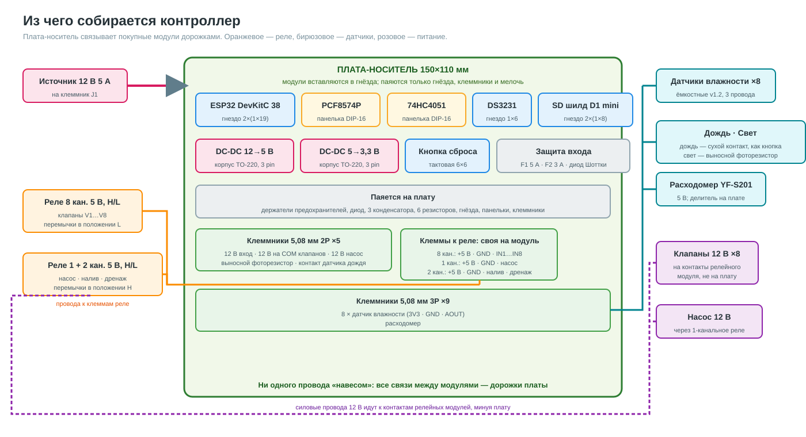
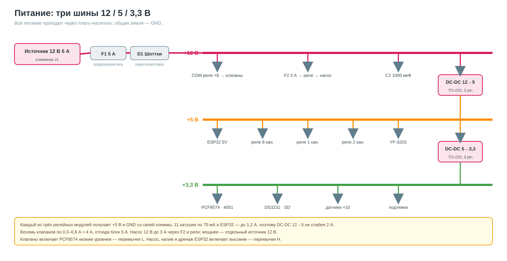
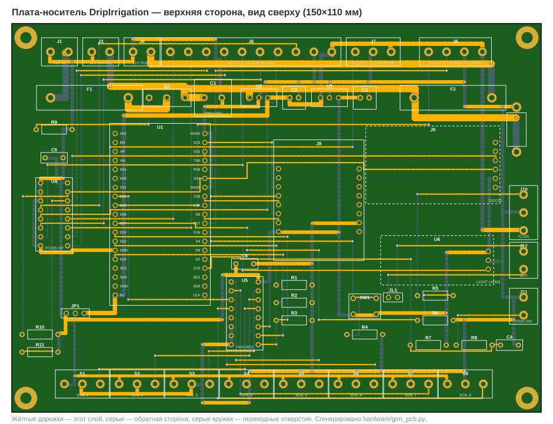
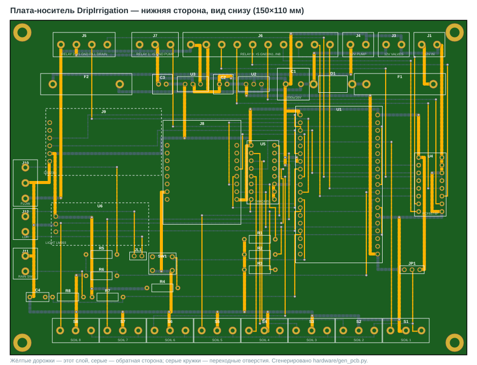
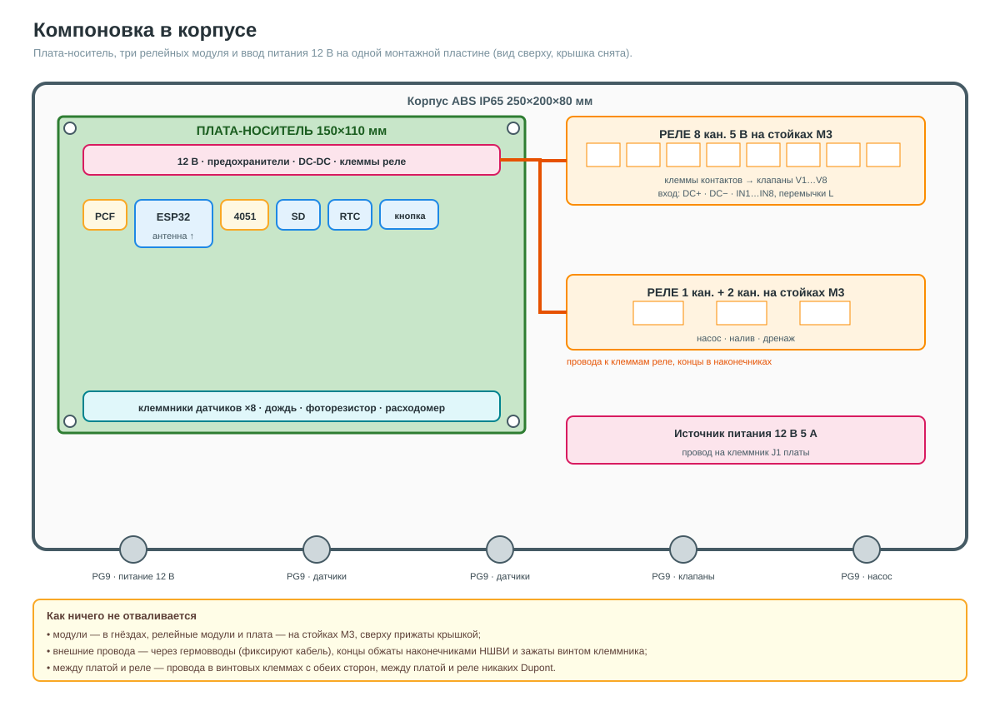

# 🧩 Плата-носитель DripIrrigation

Контроллер собирается «из кубиков»: все сложные узлы покупные, а связывает их **одна плата-носитель**,
в которую модули **вставляются в гнёзда**. На плате нет SMD, нет проводов «навесом», и ничего не отваливается:
модули сидят в гнёздах и прижаты стойками, все внешние провода — в винтовых клеммниках с обжатыми
наконечниками, в том числе провода к релейным модулям.

Плата **уже спроектирована**: файл [`hardware/DripCarrier.kicad_pcb`](../hardware/DripCarrier.kicad_pcb)
проверен DRC в KiCad 10: ошибок и неразведённых цепей нет. Раздел [5](#5-заказ-платы) — как заказать.

Распиновка ESP32 — из `pins.h` / README, без изменений.

Полный список покупок со ссылками — [bom.md](bom.md). Пошаговая сборка с картинками — [assembly.md](assembly.md).

---

## 1. Из чего состоит



### Выбранные модули

| Что | Какой именно | Куда ставится |
|---|---|---|
| ESP32 | DevKitC **38 pin**, Type-C, CP2102, вариант ESP-32U | гнездо U1 (2 гребёнки 1×19) |
| Часы | модуль DS3231 с держателем батарейки, выводы 32K · SQW · SCL · SDA · VCC · GND | гнездо J9 (1×6) |
| SD-карта | шилд Micro SD формата D1 mini, два ряда по 8 выводов | гнездо J8 (2×8) |
| Реле клапанов | красный модуль H/L, **8 каналов, 5 В**, 108,5×50 мм | клеммы J6 |
| Реле насоса | красный модуль H/L, **1 канал, 5 В**, 51×25,5 мм | клеммы J7 |
| Реле налива и дренажа | красный модуль H/L, **2 канала, 5 В** | клеммы J5 |
| Датчик света | модуль фоторезистора на LM393, выход DO; фоторезистор выпаян и вынесен наружу | гнездо U6 (1×3), фоторезистор на клеммник J12 |
| Датчики влажности ×8 | ёмкостные Capacitive Soil Moisture Sensor v2.0, кабель 3 провода | клеммники S1…S8 |

### Остальное

| Что | Что искать в магазине | Куда ставится |
|---|---|---|
| PCF8574P (микросхема DIP-16) | `PCF8574P DIP` | панелька U4 |
| 74HC4051 (микросхема DIP-16) | `CD74HC4051E DIP` / `SN74HC4051N` | панелька U5 |
| Импульсный DC-DC 12→5 В, 2 А, формат TO-220 | `K7805-2000R3` (3 pin: IN GND OUT) | U2 |
| Импульсный DC-DC 5→3,3 В, 1 А, формат TO-220 | `K7803-1000R3` (3 pin: IN GND OUT) | U3 |
| Антенна 2,4 ГГц с кабелем IPEX | `2.4G antenna IPEX u.FL` | к ESP-32U, выводится из корпуса |
| Датчик дождя Rain Seer, проводной, с сухим контактом | [товар](https://aliexpress.ru/item/1005004442230539.html?sku_id=12000029194430427) | клеммник J11 (2 провода) |
| Расходомер | `YF-S201` | клеммник J10 |
| Источник питания 12 В, не менее 5 А | любой источник постоянного тока 12 В | клеммник J1 |

### Замечания по выбранным модулям

* **ESP-32U** без встроенной антенны, у неё разъём IPEX. Без внешней антенны Wi-Fi почти не работает.
  Зато антенну можно вывести наружу корпуса, подальше от реле, и связь на участке будет лучше.
* **Ряды ESP32 38 pin** на плате разнесены на 25,4 мм. Перед заказом платы измерьте свой модуль штангенциркулем.
* **DS3231** у этого продавца, по отзывам, может прийти в варианте DS3231M. Он чуть менее точный, но часы
  всё равно синхронизируются по NTP, так что это не важно.
* **Угловые штыри у DS3231 и датчика света** нужно заменить прямыми. Модули лежат параллельно плате над
  своими гнёздами J9 и U6, штыри смотрят вниз. Выпаяйте угловую гребёнку и впаяйте прямую той же длины со
  стороны деталей модуля так, чтобы штыри выходили с обратной стороны. Если оставить угловые штыри, модуль
  встанет вертикально, будет качаться и не поместится под крышку.
* **SD-шилд D1 mini** сидит на 16 выводах и держится в гнезде крепче маленьких 6-контактных модулей.
  Используются только D5 (SCK), D6 (MISO), D7 (MOSI), D8 (CS), 3V3 и G.
* **Датчики влажности** бывают с микросхемой TLC555 и с NE555. Посмотрите маркировку восьминогой
  микросхемы на каждом датчике. TLC555 работает от 3,3 В. NE555 от 3,3 В не запускается и выдаёт 0 В,
  таким датчикам нужно 5 В. Питание всех восьми датчиков выбирается перемычкой **JP1** на плате:
  джампер на 3V3 или на 5V. Выход датчика даже при 5 В не превышает примерно 3 В, АЦП ESP32 это выдерживает.
  Не смешивайте на одной плате датчики с разными микросхемами. После смены питания датчики нужно
  перекалибровать.
* **Датчик света** стоит на плате в гнезде U6, а наружу выносится только фоторезистор. Как подготовить модуль:
  1. Выпаять фоторезистор с модуля.
  2. В освободившиеся отверстия впаять два штырька 2,54 мм.
  3. Соединить эти штырьки со штырьками JL1 на плате коротким кабелем на два провода с колодками на концах.
  4. Выносной фоторезистор подключить двумя проводами к клеммнику J12. Выводы фоторезистора закрыть термоусадкой.

  Порядок выводов гнезда U6 рассчитан на VCC · GND · DO. Сверьте с подписями на своём модуле перед пайкой гнезда.
* **Датчик дождя** механический: шайбы набухают от воды и переключают контакт. Для платы это кнопка на двух
  проводах, клеммник J11. Резистор R7 10 кОм подтягивает вход GPIO15 к 3,3 В, R8 1 кОм и конденсатор C4 100 нФ
  защищают вход от наводок на длинном кабеле. Прошивка считает дождём низкий уровень, поэтому контакт
  должен **замыкаться при дожде**. Проверьте мультиметром до подключения: сухой датчик — контакт разомкнут,
  датчик с мокрыми шайбами — замкнут. Если у датчика три провода, используйте общий и нормально разомкнутый.
  Если контакт работает наоборот, скажите: поменяю логику в прошивке.
* **PCF8574 и 74HC4051 взяты микросхемами**: у модулей разных продавцов разный порядок выводов,
  а у DIP-микросхемы он стандартный.

> ⚠️ Подписи выводов ESP32, SD-шилда и DS3231 нанесены на шелкографию платы. Перед пайкой гнёзд
> приложите свои модули и сверьте подписи — у клонов бывает зеркальный порядок.

---

## 2. Питание и реле



* Три шины: **12 В** (клапаны, насос, вход DC-DC), **5 В** (ESP32, все реле, расходомер),
  **3,3 В** (логика и датчики).
* На входе — предохранитель F1 5 А и P-MOSFET Q1 от переполюсовки. Насос — через отдельный F2 3 А.
  MOSFET вместо диода взят из-за тока: при 4–5 А диод Шоттки терял бы около 3 Вт и требовал радиатор,
  а на канале IRF4905 теряется 0,5 Вт, и клапаны получают полные 12 В. TVS-диод D2 на шине 12 В гасит
  выбросы от катушек клапанов и насоса при размыкании реле.
* Дорожки 12 В шириной 2 мм (до 5 А), 5 В — 1,2 мм, земля — 1 мм плюс сплошная заливка на нижней стороне.
* Вывод 3V3 модуля ESP32 к плате **не подключён**: свой стабилизатор модуля питает только ESP32,
  а вся периферия — от U3. Два стабилизатора на одной шине мешали бы друг другу.
* Каждый релейный модуль получает +5 В и GND со своей клеммы на плате. Одиннадцать катушек по 70 мА
  плюс ESP32 дают до 1,2 А, поэтому преобразователь 12→5 В нужен не слабее 2 А.
* **Преобразователи U2 и U3 — только импульсные** (K7805-2000R3 и K7803-1000R3). У них КПД около 90%:
  на 12→5 В при 1,2 А теряется меньше 1 Вт, радиатор не нужен. Линейный L7805 в таком же корпусе при том же
  токе рассеивал бы около 8 Вт и без большого радиатора перегрелся бы — его ставить нельзя.
* Силовые провода клапанов и насоса идут **к контактам реле**, а не через плату. Плата отдаёт на них
  +12 В с клеммников J3 (общая шина COM клапанов) и J4 (насос, после F2).

### Перемычки H/L на реле

Уровень включения задан прошивкой, поэтому перемычки ставятся так:

| Модуль | Чем управляется | Как включает прошивка | Перемычка |
|---|---|---|---|
| 8 каналов, клапаны | PCF8574, выходы P0…P7 | низким уровнем | **L** |
| 1 канал, насос | ESP32 GPIO26 | высоким уровнем | **H** |
| 2 канала, налив и дренаж | ESP32 GPIO17 и GPIO25 | высоким уровнем | **H** |

**Клапаны в режиме L работают надёжно.** PCF8574 хорошо тянет выход к земле, а в выключенном состоянии
почти не отдаёт ток, так что реле не срабатывает ложно. При включении питания PCF8574 держит выходы
в единице, клапаны закрыты.

**Насос, налив и дренаж в режиме H нужно проверить до сборки.** Модуль рассчитан на сигнал 5 В, а ESP32
выдаёт 3,3 В. Многие экземпляры срабатывают и так, но не все. Проверка занимает минуту:
подайте на модуль 5 В, перемычку поставьте в H, а на вход IN подайте 3,3 В с платы ESP32.
Реле должно щёлкнуть.

Если реле от 3,3 В не срабатывает, есть два выхода:

1. Перевести перемычку в **L** и инвертировать в прошивке управление насосом, наливом и дренажом.
   В режиме L 3,3 В на входе реле надёжно выключает, а 0 В надёжно включает.
2. Взять эти модули в варианте **12 В**: вход в режиме H у них тоже рассчитан на логику, но питание
   катушек идёт от 12 В и разгружает шину 5 В. Проверять срабатывание от 3,3 В всё равно нужно.

---

## 3. Плата

Двухсторонняя, 150×110 мм, все детали выводные. Сгенерирована скриптом
[`hardware/gen_pcb.py`](../hardware/gen_pcb.py), который расставляет компоненты, проверяет, что корпуса
не пересекаются, задаёт цепи и трассирует дорожки. Верх — дорожки в основном горизонтальные,
низ — вертикальные, снизу ещё заливка земли.

**Все детали ставятся на верхнюю сторону и паяются только с нижней.** Переворачивать плату в процессе
сборки не нужно.

**Расстановка сделана под монтаж проводов:**

* Все клеммники стоят по краям платы: сверху питание 12 В и управление реле, справа расходомер, свет и дождь,
  снизу датчики влажности. Ставьте клеммники отверстием для провода наружу, к краю платы.
* Высокие детали — предохранители, конденсаторы, модули DC-DC — стоят вторым рядом, внутри платы.
  Они не мешают заводить провода и крутить винты.
* Проверка пересечений учитывает реальные размеры модулей, а не только их гребёнки. Модуль DS3231
  размером около 38×22 мм показан на плате пунктиром и не накрывает соседние детали. Перед заказом
  измерьте свой модуль: если он крупнее, его контур нужно поправить в генераторе.





### Разъёмы к реле

У каждого релейного модуля своя клеммная колодка: питание +5 В, земля и его сигналы. Питание не
передаётся с модуля на модуль, поэтому отключение одного не обесточивает другие.

| Клеммник | Модуль | 1 | 2 | 3 | 4 | 5…10 |
|---|---|---|---|---|---|---|
| J6, 10P | реле 8 каналов | +5 В → DC+ | GND → DC− | IN1 | IN2 | IN3…IN8 |
| J7, 3P | реле 1 канал | +5 В → DC+ | GND → DC− | насос → IN | — | — |
| J5, 4P | реле 2 канала | +5 В → DC+ | GND → DC− | налив → IN1 | дренаж → IN2 | — |

### Что куда подключается

**Питание платы — клеммник J1 в левом верхнем углу.** Источник 12 В, не менее 5 А. Контакт с квадратной
площадкой — **+12 В**, второй — **GND (минус)**. Перепутанная полярность не сожжёт плату: MOSFET Q1 просто не
откроется, и плата не включится.

**Клеммники — внешние провода**

| Обозначение | Подпись на плате | Контакты по порядку, от квадратной площадки | Что подключается |
|---|---|---|---|
| J1 | 12V IN | +12 В · GND | источник питания 12 В, 5 А |
| J3 | 12V VALVES | +12 В · GND | +12 В на общий COM всех 8 реле клапанов; GND — к второму проводу клапанов |
| J4 | 12V PUMP | +12 В (после F2) · GND | +12 В на COM реле насоса; GND — к насосу |
| J6 | RELAY 8 | +5 В · GND · IN1 … IN8 | модуль реле 8 каналов: DC+, DC−, входы IN1…IN8 |
| J7 | RELAY 1 | +5 В · GND · PUMP | модуль реле 1 канал: DC+, DC−, IN |
| J5 | RELAY 2 | +5 В · GND · FILL · DRAIN | модуль реле 2 канала: DC+, DC−, IN1 налив, IN2 дренаж |
| J10 | FLOW | +5 В · GND · сигнал | расходомер YF-S201: красный, чёрный, жёлтый |
| J12 | LDR | вывод 1 · вывод 2 | выносной фоторезистор, полярности нет |
| J11 | RAIN SW | сигнал · GND | датчик дождя, сухой контакт: общий и нормально разомкнутый провод |
| S1 … S8 | SOIL 1 … 8 | питание · GND · сигнал | датчики влажности: VCC, GND, AOUT |

Питание датчиков влажности на S1…S8 — 3,3 или 5 В, выбирается джампером JP1.

**Гнёзда и панельки — модули и микросхемы**

| Обозначение | Что вставляется |
|---|---|
| U1 | ESP32 DevKitC 38 pin, USB вниз |
| J8 | шилд microSD D1 mini |
| J9 | модуль часов DS3231 |
| U6 | модуль датчика света LM393 |
| U4 | микросхема PCF8574P |
| U5 | микросхема 74HC4051 |
| U2 | импульсный DC-DC 12→5 В |
| U3 | импульсный DC-DC 5→3,3 В |

**Остальные детали на плате**

| Обозначение | Деталь | Назначение |
|---|---|---|
| F1 | предохранитель 5 А | защита всего питания 12 В |
| F2 | предохранитель 3 А | защита цепи насоса |
| Q1 | P-MOSFET IRF4905 | защита от переполюсовки, без падения напряжения |
| R9 | 10 кОм | затвор Q1 к земле |
| D2 | TVS P6KE18CA | гасит выбросы на шине 12 В |
| C5, C6 | 100 нФ | развязка PCF8574 и 74HC4051 |
| R10, R11 | 4,7 кОм | подтяжки I2C, шина работает и без модуля часов |
| C1 | 1000 мкФ | фильтр 12 В |
| C2, C3 | 100 мкФ | фильтры 5 В и 3,3 В |
| C4 | 100 нФ | фильтр входа датчика дождя |
| R1, R2, R3 | 10 кОм | подтяжка выбора канала мультиплексора |
| R4 | 10 кОм | подтяжка кнопки к земле; кнопка замыкает вход на 3,3 В |
| R5, R6 | 10 кОм, 33 кОм | делитель сигнала расходомера: с внутренней подтяжкой 10 кОм в YF-S201 даёт около 3,1 В |
| R7 | 10 кОм | подтяжка датчика дождя |
| R8 | 1 кОм | защита входа датчика дождя |
| SW1 | кнопка | сброс настроек: замыкает GPIO16 на 3,3 В, как в прошивке |
| JP1 | штыри 1×3 и джампер | питание датчиков влажности: 3V3 или 5V |
| JL1 | штыри 1×2 | кабель к площадкам фоторезистора на модуле U6 |

### Диаметры отверстий

Отверстия подобраны под выводы деталей с запасом 0,2–0,4 мм. Таблица диаметров нанесена на шелкографию
платы слева внизу, под ESP32.

| Детали | Вывод детали | Отверстие | Площадка |
|---|---|---|---|
| Клеммники 5,08 мм, все | около 1,0 мм | **1,3 мм** | 2,6 мм |
| Держатели предохранителей F1, F2 | плоский, до 1,2 мм | **1,5 мм** | 2,8 мм |
| TVS P6KE18CA (D2) | до 1,0 мм | **1,5 мм** | 2,8 мм |
| MOSFET Q1, выводы разведены на 5,08 мм | 0,9 мм | 1,1 мм | 2,0 мм |
| Гнёзда модулей ESP32, SD, DS3231, свет; штыри JP1, JL1 | 0,64 мм квадрат | 1,0 мм | 1,6 мм |
| DC-DC U2, U3, штыри | до 0,8 мм | 1,0 мм | 1,6 мм |
| Кнопка SW1 | 0,7 мм плоский | 1,0 мм | 1,7 мм |
| Конденсатор 1000 мкФ (C1) | 0,6 мм | 1,1 мм | 2,0 мм |
| Панельки DIP-16, конденсаторы 100 мкФ | 0,5 мм | 0,9 мм | 1,6–1,7 мм |
| Резисторы, керамические C4, C5, C6 | 0,6 мм | 0,8 мм | 1,6 мм |
| Крепёжные отверстия М3 | — | 3,2 мм, без металлизации | — |

Перед пайкой сверьте с реальными деталями: вывод держателя предохранителя и диода штангенциркулем.

### Что паяется

| Поз. | Деталь | Что искать | Кол-во |
|---|---|---|---|
| U1 | гребёнка-мама 1×19, machined | `machined female header 2.54 1x20` (отрезать) | 2 |
| J8 | гребёнка-мама 1×8 | `female header 2.54 1x8` | 2 |
| J9 | гребёнка-мама 1×6 | `female header 2.54 1x6` | 1 |
| U6 | гребёнка-мама 1×3 под модуль датчика света | `female header 2.54 1x3` | 1 |
| JL1 | штыри 1×2 к площадкам фоторезистора модуля | `pin header 2.54` | 1 |
| U4, U5 | панелька DIP-16 | `DIP-16 IC socket` | 2 |
| J1, J3, J4, J11, J12 | клеммник 5,08 мм 2P | `KF301-2P` или разъёмный `KF2EDG 5.08 2P` | 5 |
| J6 | клеммник 5,08 мм 10P | `KF2EDG 5.08 10P` (или 5 шт. 2P в ряд) | 1 |
| J5 | клеммник 5,08 мм 4P | `KF2EDG 5.08 4P` | 1 |
| J7, J10, S1–S8 | клеммник 5,08 мм 3P | `KF301-3P` / `KF2EDG 5.08 3P` | 10 |
| R7 | 10 кОм 0,25 Вт, подтяжка входа датчика дождя | | 1 |
| R8 | 1 кОм 0,25 Вт, защита входа датчика дождя | | 1 |
| C4 | 100 нФ керамический, шаг 5 мм | | 1 |
| F1, F2 | держатель предохранителя 5×20 + вставки 5 А, 3 А | `5x20 PCB fuse holder` | 2 |
| Q1 | P-MOSFET 55 В 74 А, TO-220 | `IRF4905` | 1 |
| D2 | TVS двунаправленный 18 В, 600 Вт | `P6KE18CA` | 1 |
| C1 | 1000 мкФ 16 В, шаг 5 мм | | 1 |
| C2, C3 | 100 мкФ 16 В, шаг 2,5 мм | | 2 |
| R1–R4, R9 | 10 кОм 0,25 Вт (подтяжки S0…S2, кнопки и затвора Q1 вниз) | | 5 |
| R10, R11 | 4,7 кОм 0,25 Вт (подтяжки I2C) | | 2 |
| C5, C6 | 100 нФ керамика, шаг 5 мм (развязка) | | 2 |
| R5, R6 | 10 кОм и 33 кОм (делитель расходомера) | | 1+1 |
| SW1 | кнопка тактовая 6×6 | | 1 |
| JP1 | штыри 1×3 + джампер (питание датчиков влажности 3,3 / 5 В) | `pin header 2.54 1x3` + `jumper cap` | 1 |
| — | стойки М3 пластик 10 мм, винты | | 16 |

Полная таблица цепей — [`hardware/netlist.md`](../hardware/netlist.md).

### Цепи, которые легко упустить

* GPIO12 (S0 мультиплексора) — strapping-пин ESP32, при старте должен быть низким: R1…R3 тянут S0…S2 к земле.
* Выход YF-S201 пятивольтовый и внутри подтянут к 5 В резистором 10 кОм: вместе с R5/R6 на GPIO27 получается
  около 3,1 В. Если у вашего экземпляра расходомера на выходе меньше 2,6 В, замените R6 на 10 кОм к 3,3 В.
* PCF8574: A0…A2 на GND → адрес 0x20, как в прошивке. 74HC4051: E и VEE на GND.
* На DS3231 и модулях датчиков подтяжки I2C и компараторы уже есть — на плате их нет специально.

---

## 4. Компоновка в корпусе



* Корпус `ABS junction box 250×200×80 IP65`. Плата и все три релейных модуля на стойках М3.
* Провода от J5, J6 и J7 к реле обжаты наконечниками НШВИ и зажаты винтами с обеих сторон.
  Если у 8-канального модуля вход сделан гребёнкой, а не клеммами, используйте одну колодку 1×10
  с обжатыми контактами, а не десять отдельных проводов.
* Ввод кабелей — гермовводы PG9; концы проводов обжаты наконечниками НШВИ (клещи `HSC8 6-4`).
* Антенна ESP-32U выводится через стенку корпуса разъёмом SMA.

---

## 5. Заказ платы

Файлы для завода собираются одной командой через KiCad 10 в Docker. Скрипт заливает землю, прогоняет DRC
и складывает Gerber-файлы со сверловкой в архив `hardware/DripCarrier-gerbers.zip`.

```bash
bash hardware/kicad-docker.sh
```

Этот архив загружается на JLCPCB или PCBWay: 2 слоя, толщина 1,6 мм, 5 штук. Стоит около 5–10 $ плюс доставка.

Хотите поменять расположение — правьте координаты в `hardware/gen_pcb.py` и запускайте его снова.
Он проверит пересечения, перетрассирует плату и обновит картинки. После этого снова запустите скрипт Docker.

```bash
python hardware/gen_pcb.py
```

---

## 6. Сборка и проверка

1. Проверить реле насоса, налива и дренажа на срабатывание от 3,3 В, как описано в разделе 2.
2. Впаять клеммники, гнёзда, панельки, резисторы, диод, конденсаторы, держатели предохранителей, кнопку.
   Модули пока не вставлять.
3. Подать 12 В на J1. Проверить: +12 на J3, 5,0 В между контактами 1 и 2 клеммника J6,
   3,3 В на выводе 16 панельки U4.
4. Вставить ESP32 с антенной, прошить, дождаться Wi-Fi.
5. Вставить PCF8574, 74HC4051, DS3231, SD — в логе прошивки должны появиться RTC и расширитель.
6. Выставить перемычки H/L, подключить реле 8 каналов к J6, 1 канал к J7, 2 канала к J5, щёлкать каналами из меню бота.
7. Обжать и подключить датчики и клапаны, откалибровать датчики влажности.
